```mermaid
flowchart TB
    subgraph Entry["Entry Point"]
        Main["main.go<br/>━━━━━━━━━<br/>Parallel Startup<br/>Silent Mode Flag"]
    end

    subgraph Core["Core Systems (sys)"]
        Config["config.go<br/>━━━━━━━━━<br/>Environment Logic<br/>Custom Prefixes"]
        Database["database.go<br/>━━━━━━━━━<br/>Context-Aware SQLite<br/>• Standardized Snowflake IDs<br/>• WAL-Mode Performance"]
        Loader["loader.go<br/>━━━━━━━━━<br/>Bulk Registration<br/>Interaction Router<br/>V2 Component Support"]
        Logger["logger.go<br/>━━━━━━━━━<br/>Structured slog Logging<br/>Dynamic AST Discovery<br/>Custom Colored Handler"]
    end

    subgraph Commands["Commands (home)"]
        direction TB
        
        subgraph CatCmd["/cat"]
            CatFact["fact (API)"]
            CatImage["image (API)"]
            CatSay["say (ANSI ASCII)"]
        end
        
        subgraph SessionCmd["/session"]
            SessionReboot["reboot (Process)"]
            SessionShutdown["shutdown (Graceful)"]
            SessionStats["stats (Metrics)"]
            SessionStatus["status (Presence)"]
        end

        subgraph LoopCmd["/loop"]
            LoopList["list (Configs)"]
            LoopSet["set (Target)"]
            LoopStart["start (Stress)"]
            LoopStop["stop (Cleanup)"]
        end

        subgraph ReminderCmd["/reminder"]
            ReminderSet["set (Natural Time)"]
            ReminderList["list (Interactive)"]
        end

        subgraph RoleColorCmd["/rolecolor"]
            RoleColorSet["set (RGB Cycle)"]
            RoleColorRefresh["refresh (Immediate)"]
        end
        
        subgraph UtilityCmd["Utilities"]
            EchoCmd["/echo (ANSI)"]
            UndertextCmd["/undertext (Sprites)"]
        end
    end

    subgraph Daemons["Background Daemons (proc)"]
        ReminderScheduler["reminderscheduler.go<br/>━━━━━━━━━<br/>10s Poll Interval<br/>Context-Safe Queries"]
        StatusRotator["statusrotator.go<br/>━━━━━━━━━<br/>15-60s Cycle<br/>Live System Metrics"]
        RoleColorRotator["rolecolorrotator.go<br/>━━━━━━━━━<br/>RGB Cycle Logic<br/>Snowflake-Safe Mapping"]
        LoopCycle["loopcycle.go<br/>━━━━━━━━━<br/>State-Aware Scheduling<br/>Websocket Health Hooks"]
        LoopManager["loopmanager.go<br/>━━━━━━━━━<br/>Webhook Looper<br/>State-Aware Scheduling"]
    end

    subgraph External["External Services"]
        Discord["Discord API v10"]
        CatAPI["Cat APIs<br/>• fact/image"]
        UndertaleAPI["Demirramon API<br/>• Box Generator"]
    end

    %% Entry connections
    Main --> Config
    Main --> Database
    Main --> Loader
    
    %% Core system connections
    Loader --> Logger
    Database --> Logger

    %% Command registration
    Loader --> CatCmd
    Loader --> SessionCmd
    Loader --> LoopCmd
    Loader --> ReminderCmd
    Loader --> RoleColorCmd
    Loader --> UtilityCmd

    %% Daemon startup
    Main --> ReminderScheduler
    Main --> StatusRotator
    Main --> RoleColorRotator
    Main --> LoopCycle
    Main --> LoopManager

    %% Daemon dependencies
    ReminderScheduler --> Database
    RoleColorRotator --> Database
    LoopCycle --> Database
    LoopManager --> Database

    %% External API connections
    CatCmd --> CatAPI
    UtilityCmd --> UndertaleAPI
    Loader --> Discord
    Daemons --> Discord

    %% Styling
    classDef entryStyle fill:#1a1a2e,stroke:#e94560,stroke-width:2px,color:#fff
    classDef coreStyle fill:#16213e,stroke:#0f3460,stroke-width:2px,color:#fff
    classDef cmdStyle fill:#1a1a2e,stroke:#4a90a4,stroke-width:2px,color:#fff
    classDef daemonStyle fill:#1a1a2e,stroke:#9b59b6,stroke-width:2px,color:#fff
    classDef externalStyle fill:#2d3436,stroke:#00b894,stroke-width:2px,color:#fff

    class Main entryStyle
    class Config,Database,Loader,Logger coreStyle
    class CatFact,CatImage,CatSay,SessionReboot,SessionShutdown,SessionStats,SessionStatus,LoopList,LoopSet,LoopStart,LoopStop,ReminderSet,ReminderList,RoleColorSet,RoleColorRefresh,EchoCmd,UndertextCmd cmdStyle
    class ReminderScheduler,StatusRotator,RoleColorRotator,LoopCycle,LoopManager daemonStyle
    class Discord,CatAPI,UndertaleAPI externalStyle
```

```
minder/
│
├── main.go                       # Go entry point
├── go.mod                        # Go module dependencies
├── go.sum                        # Go dependency checksums
|
├── Dockerfile                    # Multi-stage build
├── docker-compose.yml            # Multi-service deployment
|
├── home/                         # [Discord Commands]
│   ├── cat...go                  # /cat command router
│   ├── cat.fact.go               # /cat fact handler
│   ├── cat.image.go              # /cat image handler
│   ├── cat.say.go                # /cat say (ANSI) handler
│   ├── echo...go                 # /echo command (Admin)
│   ├── loop...go                 # /loop command router
│   ├── loop.list.go              # /loop list handler
│   ├── loop.set.go               # /loop set handler
│   ├── loop.start.go             # /loop start (Stress) handler
│   ├── loop.stop.go              # /loop stop (Cleanup) handler
│   ├── reminder...go             # /reminder command router
│   ├── reminder.list.go          # /reminder list handler
│   ├── reminder.set.go           # /reminder set handler
│   ├── rolecolor...go            # /rolecolor command router
│   ├── rolecolor.refresh.go      # /rolecolor refresh handler
│   ├── rolecolor.reset.go        # /rolecolor reset handler
│   ├── rolecolor.set.go          # /rolecolor set handler
│   ├── session...go              # /session command router
│   ├── session.reboot.go         # /session reboot handler
│   ├── session.shutdown.go       # /session shutdown handler
│   ├── session.stats.go          # /session stats handler
│   ├── session.status.go         # /session status handler
│   └── undertext.go              # /undertext image generator
│
├── proc/                         # [Background Daemons]
│   ├── loopcycle.go              # State-aware scheduling
│   ├── loopmanager.go            # Webhook loop manager
│   ├── reminderscheduler.go      # Reminder notification daemon
│   ├── rolecolorrotator.go       # Role color cycle daemon
│   └── statusrotator.go          # Status cycle daemon
│
└── sys/                          # [Core Systems]
    ├── config.go                 # Environment configuration
    ├── database.go               # SQLite database layer
    ├── loader.go                 # Session creation & registration
    └── logger.go                 # Leveled Logging & AST Discovery
```