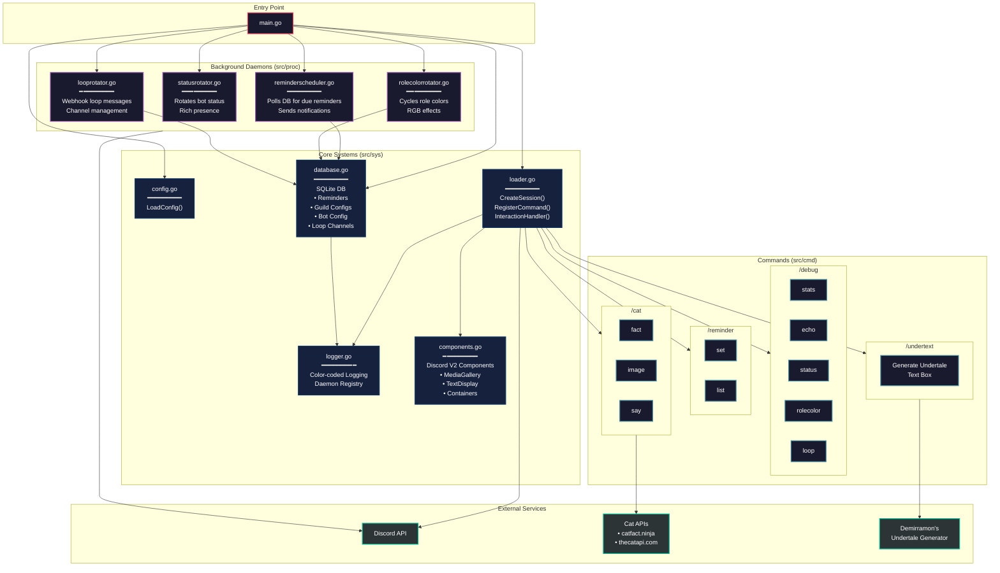

```diff
 minder/
+ ├── main.go                    # Entry point, process management, initialization
  ├── src/
+ │   ├── cmd/                   # Slash command handlers (Green)
+ │   │   ├── cat.go
+ │   │   ├── cat.fact.go
+ │   │   ├── cat.image.go
+ │   │   ├── cat.say.go
+ │   │   ├── debug.go
+ │   │   ├── debug.echo.go
+ │   │   ├── debug.loop.go
+ │   │   ├── debug.rolecolor.go
+ │   │   ├── debug.stats.go
+ │   │   ├── debug.status.go
+ │   │   ├── reminder.go
+ │   │   ├── reminder.set.go
+ │   │   ├── reminder.list.go
+ │   │   ├── undertext.go
+ │   │   └── undertext.handler.go
- │   ├── proc/                  # Background daemons/processes (Red)
- │   │   ├── looprotator.go
- │   │   ├── reminderscheduler.go
- │   │   ├── rolecolorrotator.go
- │   │   └── statusrotator.go
+ │   └── sys/                   # Core system utilities (Green)
+ │       ├── components.go
+ │       ├── config.go
+ │       ├── database.go
+ │       ├── loader.go
+ │       └── logger.go
  ├── data.db                    # SQLite database
  ├── go.mod                     # Go module definition
  └── go.sum                     # Dependency checksums
```