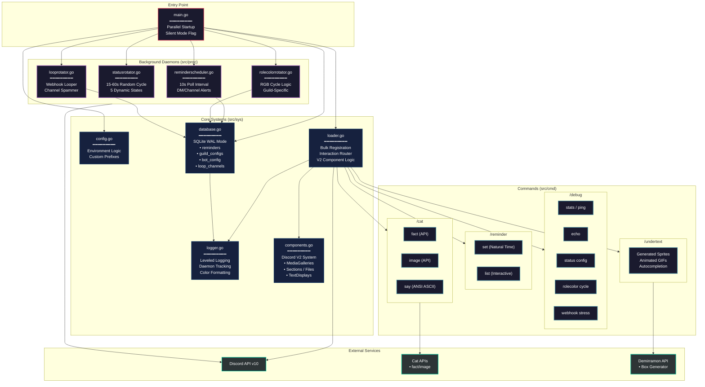

```
minder/
|
├── main.go                       # Go entry point
├── go.mod                        # Go module dependencies
├── go.sum                        # Go dependency checksums
|
└──src/
   |
   ├──cmd/
   |  |
   │  ├── cat...go                # /cat command registration & shared logic
   │  ├── cat.fact.go             # Cat fact (catfact.ninja) handler
   │  ├── cat.image.go            # Cat image (thecatapi.com) handler
   │  ├── cat.say.go              # ASCII cowsay-style cat generator
   │  |
   │  ├── debug...go              # /debug command registration & shared logic
   │  ├── debug.echo.go           # Basic echoed message
   │  ├── debug.loop.go           # Webhook loop manager
   │  ├── debug.rolecolor.go      # RGB role color cycle configuration
   │  ├── debug.stats.go          # Live system metrics
   │  ├── debug.status.go         # Presence visibility configuration
   │  |
   │  ├── reminder...go           # /reminder command registration & shared logic
   │  ├── reminder.set.go         # Natural language time parsing & storage
   │  ├── reminder.list.go        # Interactive view of pending reminders
   │  |
   │  ├── undertext...go          # /undertext command registration & shared logic
   │  └── undertext.handler.go    # Demirramon API bridge (Static/Animated)
   |
   ├──proc/
   |  |
   │  ├── looprotator.go          # Webhook loop daemon
   │  ├── reminderscheduler.go    # Reminder notification daemon
   │  ├── rolecolorrotator.go     # Role color cycle daemon
   │  └── statusrotator.go        # Status cycle daemon
   |
   └──sys/
      |
      ├── components.go           # Discord V2 Component wrappers
      ├── config.go               # Environment validation
      ├── database.go             # SQLite database layer
      ├── loader.go               # Session creation & command registration
      └── logger.go               # Prefix-based color logging
```