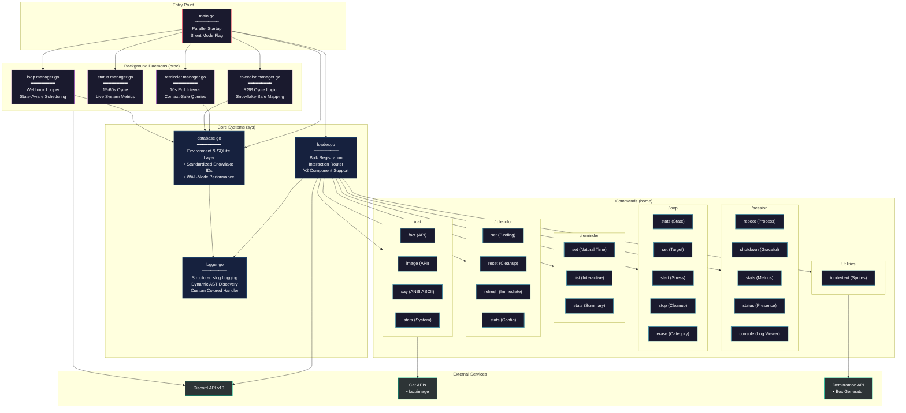

```
minder/
│
├── main.go                       # Go entry point
├── go.mod                        # Go module dependencies
├── go.sum                        # Go dependency checksums
|
├── Dockerfile                    # Multi-stage build
├── docker-compose.yml            # Multi-service deployment
|
├── home/                         # [Slash Commands]
│   ├── cat...go                  # /cat router
│   ├── cat.fact.go               # /cat fact
│   ├── cat.image.go              # /cat image
│   ├── cat.say.go                # /cat say
│   ├── cat.stats.go              # /cat stats
│   ├── loop...go                 # /loop router
│   ├── loop.erase.go             # /loop erase
│   ├── loop.set.go               # /loop set
│   ├── loop.start.go             # /loop start
│   ├── loop.stop.go              # /loop stop
│   ├── loop.stats.go             # /loop stats
│   ├── reminder...go             # /reminder router
│   ├── reminder.list.go          # /reminder list
│   ├── reminder.set.go           # /reminder set
│   ├── reminder.stats.go         # /reminder stats
│   ├── rolecolor...go            # /rolecolor router
│   ├── rolecolor.refresh.go      # /rolecolor refresh
│   ├── rolecolor.reset.go        # /rolecolor reset
│   ├── rolecolor.set.go          # /rolecolor set
│   ├── rolecolor.stats.go        # /rolecolor stats
│   ├── session...go              # /session router
│   ├── session.console.go        # /session console
│   ├── session.reboot.go         # /session reboot
│   ├── session.shutdown.go       # /session shutdown
│   ├── session.stats.go          # /session stats
│   ├── session.status.go         # /session status
│   └── undertext.go              # /undertext
│
├── proc/                         # [Background Daemons]
│   ├── loop.manager.go           # Webhook loop manager
│   ├── reminder.manager.go       # Reminder notification daemon
│   ├── rolecolor.manager.go      # Role color cycle daemon
│   └── status.manager.go         # Status cycle daemon
│
└── sys/                          # [Core Systems]
    ├── database.go               # Configuration & SQLite layer
    ├── loader.go                 # Session creation & registration
    └── logger.go                 # Leveled Logging & AST Discovery
```