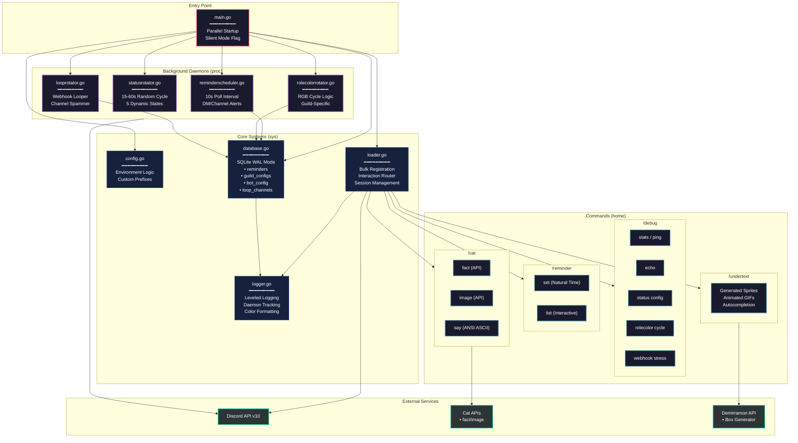

```
minder/
│
├── main.go                       # Go entry point
├── go.mod                        # Go module dependencies
├── go.sum                        # Go dependency checksums
│
├── home/                         # [Discord Commands]
│   ├── cat...go                  # /cat command logic
│   ├── cat.fact.go               # /cat fact (catfact.ninja) handler
│   ├── cat.image.go              # /cat image (thecatapi.com) handler
│   ├── cat.say.go                # /cat say (ANSI ASCII) handler
│   ├── debug...go                # /debug command logic
│   ├── debug.echo.go             # /debug echo (ANSI ASCII) handler
│   ├── debug.loop.go             # /debug loop (Webhook) handler
│   ├── debug.rolecolor.go        # /debug rolecolor (RGB) handler
│   ├── debug.stats.go            # /debug stats (Live System Metrics) handler
│   ├── debug.status.go           # /debug status (Presence Visibility) handler
│   ├── reminder...go             # /reminder command logic
│   ├── reminder.set.go           # /reminder set (Natural Language Time) handler
│   ├── reminder.list.go          # /reminder list (Interactive View) handler
│   ├── undertext...go            # /undertext command logic
│   └── undertext.handler.go      # /undertext (Demirramon API bridge) handler
│
├── proc/                         # [Background Daemons]
│   ├── looprotator.go            # Webhook loop daemon
│   ├── reminderscheduler.go      # Reminder notification daemon
│   ├── rolecolorrotator.go       # Role color cycle daemon
│   └── statusrotator.go          # Status cycle daemon
│
├── sys/                          # [Core Systems]
│   ├── config.go                 # Environment configuration
│   ├── database.go               # SQLite database layer
│   ├── loader.go                 # Session creation & command registration
│   └── logger.go                 # Prefix-based color logging
└── README.md                     # Project documentation
```