```mermaid
flowchart TB
    subgraph Entry["Entry Point"]
        Main["main.go"]
    end

    subgraph Core["🔧 Core Systems (src/sys)"]
        Config["config.go<br/>━━━━━━━━━<br/>LoadConfig()"]
        Database["database.go<br/>━━━━━━━━━<br/>SQLite DB<br/>• Reminders<br/>• Guild Configs<br/>• Bot Config<br/>• Loop Channels"]
        Loader["loader.go<br/>━━━━━━━━━<br/>CreateSession()<br/>RegisterCommand()<br/>InteractionHandler()"]
        Logger["logger.go<br/>━━━━━━━━━<br/>Color-coded Logging<br/>Daemon Registry"]
        Components["components.go<br/>━━━━━━━━━<br/>Discord V2 Components<br/>• MediaGallery<br/>• TextDisplay<br/>• Containers"]
    end

    subgraph Commands["🎮 Commands (src/cmd)"]
        direction TB
        
        subgraph CatCmd["/cat"]
            CatFact["fact"]
            CatImage["image"]
            CatSay["say"]
        end
        
        subgraph DebugCmd["/debug"]
            DebugStats["stats"]
            DebugEcho["echo"]
            DebugStatus["status"]
            DebugRoleColor["rolecolor"]
            DebugLoop["loop"]
        end
        
        subgraph ReminderCmd["/reminder"]
            ReminderSet["set"]
            ReminderList["list"]
        end
        
        subgraph UndertextCmd["/undertext"]
            UndertextGen["Generate Undertale<br/>Text Box"]
        end
    end

    subgraph Daemons["Background Daemons (src/proc)"]
        ReminderScheduler["reminderscheduler.go<br/>━━━━━━━━━<br/>Polls DB for due reminders<br/>Sends notifications"]
        StatusRotator["statusrotator.go<br/>━━━━━━━━━<br/>Rotates bot status<br/>Rich presence"]
        RoleColorRotator["rolecolorrotator.go<br/>━━━━━━━━━<br/>Cycles role colors<br/>RGB effects"]
        LoopRotator["looprotator.go<br/>━━━━━━━━━<br/>Webhook loop messages<br/>Channel management"]
    end

    subgraph External["External Services"]
        Discord["Discord API"]
        CatAPI["Cat APIs<br/>• catfact.ninja<br/>• thecatapi.com"]
        UndertaleAPI["Demirramon's<br/>Undertale Generator"]
    end

    %% Entry connections
    Main --> Config
    Main --> Database
    Main --> Loader
    
    %% Core system connections
    Loader --> Logger
    Loader --> Components
    Database --> Logger

    %% Command registration
    Loader --> CatCmd
    Loader --> DebugCmd
    Loader --> ReminderCmd
    Loader --> UndertextCmd

    %% Daemon startup
    Main --> ReminderScheduler
    Main --> StatusRotator
    Main --> RoleColorRotator
    Main --> LoopRotator

    %% Daemon dependencies
    ReminderScheduler --> Database
    RoleColorRotator --> Database
    LoopRotator --> Database

    %% External API connections
    CatCmd --> CatAPI
    UndertextCmd --> UndertaleAPI
    Loader --> Discord
    Daemons --> Discord

    %% Styling
    classDef entryStyle fill:#1a1a2e,stroke:#e94560,stroke-width:2px,color:#fff
    classDef coreStyle fill:#16213e,stroke:#0f3460,stroke-width:2px,color:#fff
    classDef cmdStyle fill:#1a1a2e,stroke:#4a90a4,stroke-width:2px,color:#fff
    classDef daemonStyle fill:#1a1a2e,stroke:#9b59b6,stroke-width:2px,color:#fff
    classDef externalStyle fill:#2d3436,stroke:#00b894,stroke-width:2px,color:#fff

    class Main entryStyle
    class Config,Database,Loader,Logger,Components coreStyle
    class CatFact,CatImage,CatSay,DebugStats,DebugEcho,DebugStatus,DebugRoleColor,DebugLoop,ReminderSet,ReminderList,UndertextGen cmdStyle
    class ReminderScheduler,StatusRotator,RoleColorRotator,LoopRotator daemonStyle
    class Discord,CatAPI,UndertaleAPI externalStyle
```

```
minder/
├── main.go                    # Entry point, process management, initialization
├── src/
│   ├── cmd/                   # Slash command handlers
│   │   ├── cat.go             # /cat command registration
│   │   ├── cat.fact.go        # Cat fact subcommand
│   │   ├── cat.image.go       # Cat image subcommand  
│   │   ├── cat.say.go         # Cowsay-style cat subcommand
│   │   ├── debug.go           # /debug command registration
│   │   ├── debug.echo.go      # Echo subcommand
│   │   ├── debug.loop.go      # Loop management subcommand
│   │   ├── debug.rolecolor.go # Role color rotation control
│   │   ├── debug.stats.go     # Bot statistics
│   │   ├── debug.status.go    # Status rotation control
│   │   ├── reminder.go        # /reminder command registration
│   │   ├── reminder.set.go    # Set reminder subcommand
│   │   ├── reminder.list.go   # List/dismiss reminders
│   │   ├── undertext.go       # /undertext command registration
│   │   └── undertext.handler.go
│   ├── proc/                  # Background daemons/processes
│   │   ├── looprotator.go     # Webhook loop message daemon
│   │   ├── reminderscheduler.go
│   │   ├── rolecolorrotator.go
│   │   └── statusrotator.go
│   └── sys/                   # Core system utilities
│       ├── components.go      # Discord V2 component builders
│       ├── config.go          # Environment configuration
│       ├── database.go        # SQLite database layer
│       ├── loader.go          # Session & command registration
│       └── logger.go          # Color-coded logging & daemon registry
├── data.db                    # SQLite database
├── go.mod                     # Go module definition
└── go.sum                     # Dependency checksums
```